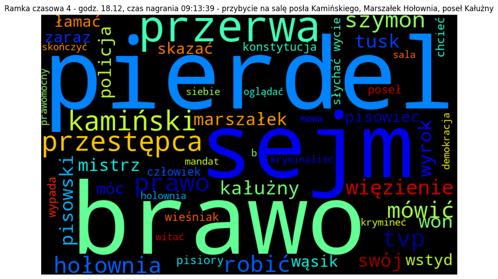

# Analiza wpisów na czacie YouTube
Analiza wpisów czatu YT z posiedzenia sejmu w dn. 21.12.2023 (ustawa budżetowa)

Dane zawierają wpisy z czatu użytkowników kanału sejmu RP na YouTube z posiedzenia sejmu w dn. 21.12.2023 - debaty nad ustawą budżetową.
Źródło danych: https://www.youtube.com/watch?v=NxAyPHdVDyM

    <h3 align="left"><a id = "R5."><h1>Wnioski:</h1></a></h3>
    <ol>
        <li>Zbiór danych zawiera 34.320 wpisów 9.633 unikalnych użytkowników.</li>
        <li>Osoby korzystające z czatu YT dokonały łącznie 3.503 zdublowanych wpisów (kopiuj/wklej), co stanowiło 10.2% wszystkich wypowiedzi.</li>
        <li>Osoby obserwujące obrady w ciągu 1 minuty dokonywały średnio 45 wpisów.</li>
        <li>Największą liczbę wpisów odnotowano przy nicku 'Kiju_' - 654, co stanowiło 1.9% pozycji. Teksty były niezwiązane z tematyką posiedzienia i były ukierunkowane na pozyskanie pieniędzy.</li>
        <li>Usunięto posty ze słowem MESSI (487 wystąpień) wprowadzające szum dla analizy postów.</li>
        <li>Zwiększoną liczbę wpisów, dochodzącą nawet do 200/min. odnotowano przy wystąpieniach:
            <ul>
                <li>posła Romana Giertycha - godz. 09:14, czas nagrania 00:15:39 </li>
                <li>posła Romana Giertycha, Marszałka Szymona Hołowni i posła Mariusza Błaszczaka - godz. 09:35, czas nagrania 00:36:39</li>
                <li>posłanki Elżbiety Witek - godz. 14:07, czas nagrania 05:08:39</li>
                <li>przybycie na salę posła Kamińskiego, Marszałek Hołownia, poseł Kałużny - godz. 18.12, czas nagrania 09:13:39</li>
            </ul>
        </li>
        <li>Przy pomocy biblioteki TextBlob określony został język wypowiedzi. Wszystkie pozycje zostały oznaczone jako wpisy w języku polskim, jednak niektóre teksty zawierały słowa w innych językach i nie zostały poprawnie zidentyfikowane.</li>
        <li><b>Algorytmy bibliotek TextBlob i NLTK różnie potraktowały analizowane teksty. Biblioteka TextBlob znaczącą liczbę wpisów potraktowała jako neutralną, a liczba wpisów pozytywnych była prawie czterokrotnie większa niż negatywnych.  
Biblioteka NLTK oznaczyła teksty w większości jako neutralne, dwa razy więcej wpisów jako pozytywne i aż ponad 10 razy więcej jako negatywne w odniesieniu do biblioteki TextBlob.</b></li>
        <li>Wśród par słów najczęściej wystąpił zwrot panie marszałku. W dalszej kolejności możemy wyróżnić pary "tvp info", "wycie" ze słowami "słychać" i "znakomicie", "wesołych świąt", "fundusz kościelny" i "brawo panie".  
W trigramach, podobnie jak w bigramach królowało połączenie "słychać wycie znakomicie". Często wspominana jest równość obywateli wobec prawa oraz pochwała "brawo panie marszałku".</li>
        <li>Podczas wystąpienia posła Romana Giertycha (godz. 09:14) najczęsciej występującymi były słowa: "słychać", "wycie", "pisiora", "znakomicie", "cyrk", "giertych".</li>
        <li>W trakcie drugiego zakresu zwiększonej liczby wpisów (wystąpienia posła Romana Giertycha, Marszałka Szymona Hołowni i posła Mariusza Błaszczaka - godz. 09:35) dominowały we wpisach słowa "hołownia", "brawo", "won", "wychodzić", "błaszczak" i "siadać".</li>
        <li>Wystąpieniu posłanki Elżbiety Witek (godz. 14:07) towarzyszyły wpisy: "witek", "reasumpcja", "kobieta", "mówić" i "tvp".</li>
        <li>W chwili przybycia na salę posła Kamińskiego (godz. 18.12) wyszczególnić należy zwiększoną liczbę słów "pierdel", "sejm", "brawo", "przestępca" i "kamiński".</li>
        <li>Wpisy dokonane przez użytkowników były lakoniczne, co uniemożliwiło określenia tematyki poruszanej w wypowiedziach przez modele LDA. Najwyższe wartości spójności tematów wskazane zostały na poziomie 55% dla wszystkich słów oraz 60% dla rzeczowników.</li>
        <li>Grupowanie użytkowników według napisanych tekstów przy pomocy algorytmu K-means (k-średnich) oraz określenie optymalnej liczby klastrów przy pomocy wykresu łokciowego nie pozwala na wyciągnięcie odpowiednich wniosków</li>
        <li>Przeprowadzenie grupowania w ramach 3 klastrów umożliwiło rozdzielenie wypowiedzi użytkowników według tekstów nawiązujących do marszałka oraz budżetu i telewizji. 7.4% wypowiedzi można również uznać jako wpisy zradykalizowane, zawierające takie słowa jak 'wstyd', 'magdalenka' czy 'precz'.</li>
    </ol>
    
<h2>Obsługa języka polskiego w obu bibliotekach jest jeszcze niedopracowana, w związku z tym do analizy tekstów dobrze jest porównać wyniki przez nie przedstawiane.</h2>

    
<h2>Interpretacja tematów poruszanych we wpisach jest subiektywna i zależy od wielu czynników, takich jak np. eliminowanie stop words.</h2>

